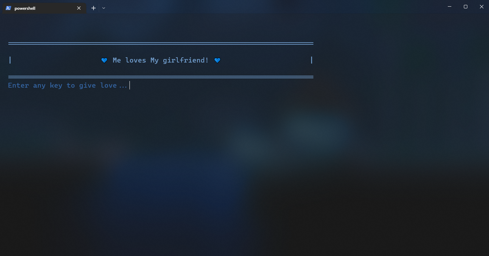

# python-with-love
[](https://github.com/gh0sth4ckk/python-with-love)
[](https://github.com/gh0sth4ckk/python-with-love/blob/main/LICENSE)

Give love with python! You can wish love to your girl, parents or your best friend. This short script can surprise 
your loved ones (especially if they not know what this).



# Installation
Requires Python 3.10+ and terminal, which have support unicode chars (ex. Windows terminal)
1. Git clone project:
```shell
git clone https://github.com/gh0sth4ckk/python-with-love.git
```
2. Create and activate python environment.
3. Install requirements for project:
```shell
pip install -r requirements.txt
```
4. Start `give_love.py` file.

# Help
For start app, start `give_love.py` file. This file support next flags:
- `-h` or `--help` - print help message in console,
- `-u1 <username>` - set first username; default value: `user1`,
- `-u2 <username>` - set second username; default value: `user2`,
- `-t "<custom message>"` or `--text "<custom message>"` - set a custom message to wish love; default value: `oh loves you,`,
- `-c <color>` or `--color <color>` - set color to message; default value: `w` (white),
Example:
```shell
python give_love.py -u1 Me -u2 "My girlfriend" -t "loves" -c g
```
# Support colors
To change message color you need to use `-c` or `--color` flag and use character alias one of eight the following colors:
- `r` - Red,
- `g` - Green,
- `b` - Blue,
- `y` - Yellow,
- `p` - Purple,
- `g` - Green,
- `bl` - Black,
- `w` - White.